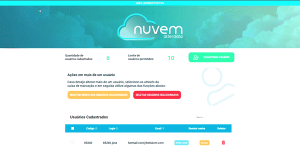
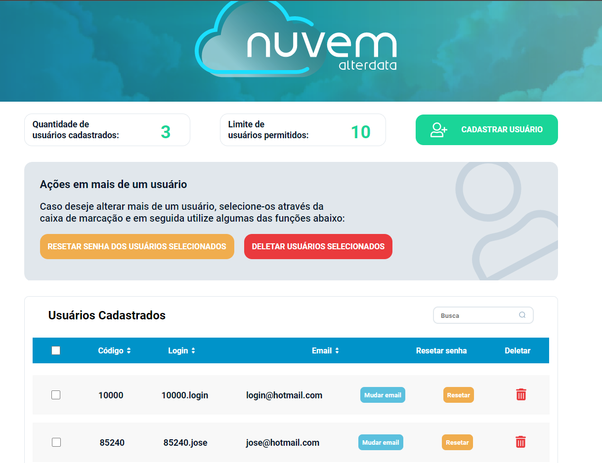
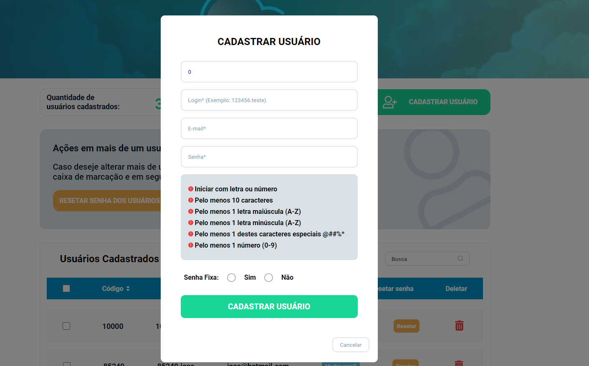
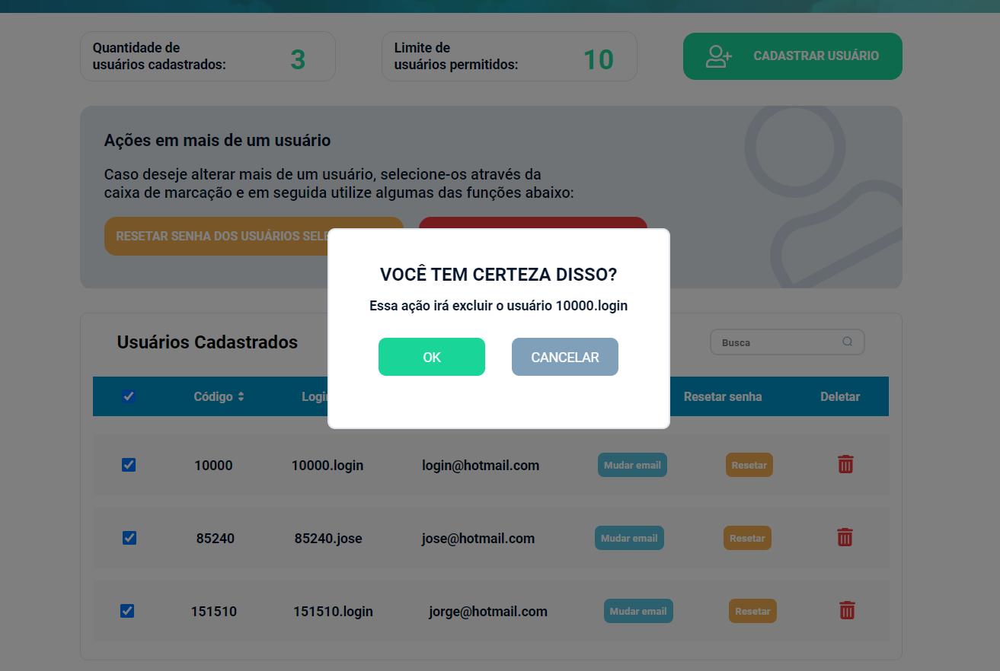

<h1 align="center">
  Nuvem Alterdata
</h1>

- - -

<h1>Preview</h1>

  

 
  

 
  

 
  

 

## Tecnologias

 Esse projeto foi desenvolvido com as seguintes tecnologias:

- REACTJS 
- STYLED COMPONENTS
- FAKE JSON SERVER
  

## Projeto

 Caso queira rodar essa aplicação em sua máquina, basta usar os comandos: 

 - yarn 
 - yarn start
 - yarn server